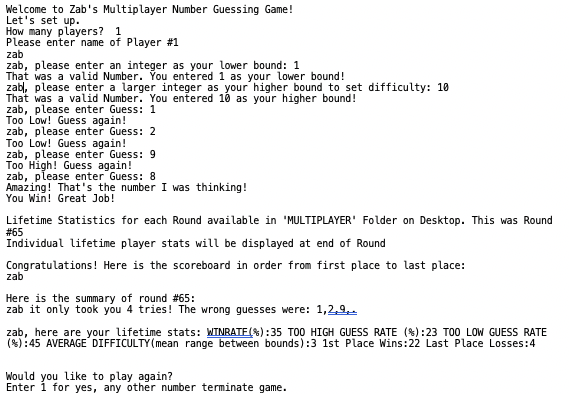
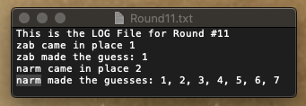

# Java-Multiplayer-Number-Game
A game which asks how many users, asks users to enter a range (lower bound/upperbound) for difficulty, generates a random number for each user, then makes users guess their integer round by round until everyone correctly guesses their number. 
The game then creates a log in a folder on desktop (location can be customized) of each round ever played. 
Creates a scoreboard for players. 
Creates a round summary displaying wrong tries and wrong try count. 
Displays some average lifetime statistics of each player who plays after each round. 
Asks users to play again. 

## SET UP:  MUST CREATE NEW DIRECTORY (preferably on desktop) FOR GAME AND REPLACE PATH OBJECTS WITH CUSTOM PATH OBJECTS FOR YOUR OWN DESKTOP AND USERS
    (i.e. replace "/Users/zabeerrahman/Desktop/MULTIPLAYER/TotalRoundCount.txt" on line 117 with your working directory, with constant file extension. REpeat with all path objects)
    
### Multiplayer:
  * TotalRoundCount.txt 
        A log which keeps track of total lifetime rounds played so game can display the count in console.
  * Round11.txt 
        A *sample* round log (must be opened manually to read) which displays many details of the round:
        
  * SCORECARDS Folder:
    * zab.txt 
    A *sample* log which keeps track of numerous lifetime statistics of each user so game can calculate desired statistics and display in console.  
 __Desired Statistics__
        * Win rate *(%)*
        * Too high guess rate *(%)*
        * Too low guesss rate *(%)*
        * Average difficulty *(mean range between bounds)*
        * 1st place win count
        * Last place count

